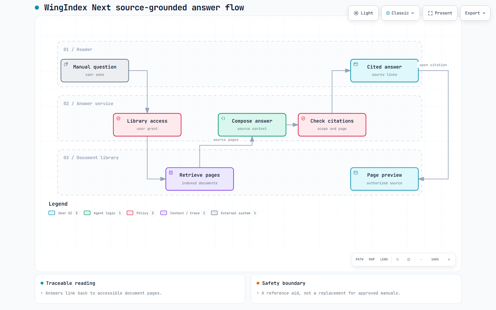

# WingIndex Next

**A source-grounded aviation document assistant.**

WingIndex Next is a private, locally running pilot-document application. It helps authorized users search their own manual libraries, ask questions, and open the exact source pages behind an answer.

## The answer flow

The engineering work focuses on:

- Checking a user's library access before search, answer generation, or source viewing.
- Retrieving relevant document pages and building answers with page-level citations.
- Binding citations to a document revision and original PDF page.
- Letting readers open the cited page as a preview instead of downloading an entire manual.
- Preparing supported text-layer PDFs with resumable uploads and processing checkpoints.

**Selected stack:** Node.js, SQLite, a responsive web client, and PDF page previews.

**Current status:** A local pilot application. Independent HTTPS hosting and on-device offline answering are not complete. It is a reference aid, not a substitute for approved manuals or aircraft-specific checks.

## Development activity

WingIndex and WingIndex Next are separate private repositories in the same project family. Their GitHub histories show **30 pull requests in total, 28 merged**:

| Repository | Development history | Pull requests | Merged | Commits on main |
| --- | --- | ---: | ---: | ---: |
| WingIndex | August–September 2026 (~1 month) | 27 | 25 | 65 |
| WingIndex Next | September 2026 (under 1 month) | 3 | 3 | 80 |

*Figures are repository-specific snapshots as of September 24, 2026. The public repository contains an overview and diagram; source code and manual content remain private.*
